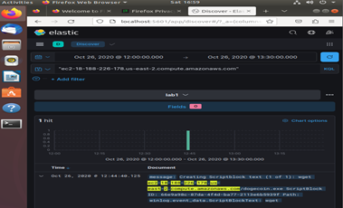
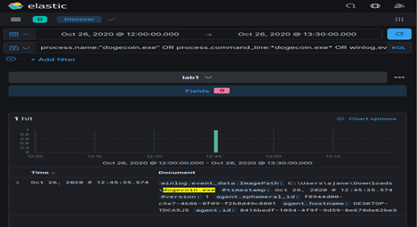

# PowerShell LotL Investigation Lab - Host-Based Incident Investigation

A hands-on endpoint investigation lab analyzing a PowerShell-based Living-off-the-Land (LotL) attack using Kibana and Windows event logs reconstructing the attack timeline, identifying persistence mechanisms, extracting IOCs, and mapping findings to MITRE ATT&CK.

---

## Scenario

An IDS alert flagged suspicious executable activity on host `DESKTOP-TDCA5J5`. Investigation revealed that user `ajane` executed an interactive PowerShell session that downloaded and installed a malicious payload, established persistence via Windows services, and retrieved a second-stage backdoor from an external AWS EC2 host - all using native Windows utilities.

---

## Environment

| Component | Details |
|---|---|
| SIEM | Kibana (Lab data view) |
| Time Range | 2020-10-26 12:40:00 → 13:10:00 UTC |
| Log Sources | PowerShell ScriptBlock (Event ID 4104), Service Control Manager (Event ID 7045), DNS logs, Process creation logs |

---

## Attack Summary

The attacker leveraged built-in Windows tools throughout - no custom exploitation framework required.

1. PowerShell session under `ajane` downloaded malicious executable `r.exe`
2. Created Windows service **Caculator** to execute `r.exe` with LocalSystem privileges
3. Encoded PowerShell command downloaded second-stage payload `dogecoin.exe` from AWS EC2
4. Installed `dogecoin.exe` as auto-start service **PleaseDontFindMe** under LocalSystem

This is a textbook LotL persistence chain - PowerShell + Service Control Manager + encoded commands + external C2.

---

## Investigation Methodology - KQL Queries

```kql
# Initial payload search
"r.exe"

# PowerShell activity under compromised user
winlog.user.name:"ajane" AND event.provider:"Microsoft-Windows-PowerShell"

# Service installations
winlog.event_id:7045

# Encoded command detection
process.command_line:*EncodedCommand*

# Suspicious download activity
winlog.event_data.ScriptBlockText:(wget OR Invoke-WebRequest OR IEX OR "http")

# DNS pivot to C2 infrastructure
dns.question.name:*ec2-18-188-226-178*
```

---

## Attack Timeline

| Time (UTC) | Event ID | Description |
|---|---|---|
| 12:44:03 | DNS | Resolution of AWS EC2 C2 domain |
| 12:44:16 | 4104 | Attempted service creation (typo - first attempt) |
| 12:44:26 | 4104 | Successful `New-Service` command for `r.exe` |
| 12:44:26 | 7045 | Service **Caculator** installed (Auto, LocalSystem) |
| 12:44:40 | 4104 | Encoded PowerShell command executed - second-stage download |
| 12:45:35 | 7045 | Service **PleaseDontFindMe** installed (Auto, LocalSystem) |





---

## Indicators of Compromise (IOCs)

| Type | Indicator |
|---|---|
| Victim Host | `DESKTOP-TDCA5J5` |
| Victim IP | `192.168.36.174` |
| Compromised User | `ajane` |
| Initial Payload | `C:\Users\ajane\Downloads\r.exe` |
| Malicious Service 1 | `Caculator` |
| Second-Stage Payload | `C:\Users\ajane\Downloads\dogecoin.exe` |
| Malicious Service 2 | `PleaseDontFindMe` |
| C2 Domain | `ec2-18-188-226-178.us-east-2.compute.amazonaws.com` |
| C2 IP | `18.188.226.178` |

---

## MITRE ATT&CK Mapping

| Technique | ID | Evidence |
|---|---|---|
| PowerShell | T1059.001 | Interactive PS session used throughout attack |
| Encoded Command | T1027 | `-EncodedCommand` used to obfuscate second-stage download |
| Ingress Tool Transfer | T1105 | `dogecoin.exe` downloaded from external EC2 host |
| Create or Modify System Process: Windows Service | T1543.003 | Services `Caculator` and `PleaseDontFindMe` installed via `New-Service` |
| Boot or Logon Autostart: Services | T1547 | Both services configured as Auto-start under LocalSystem |
| Exfiltration/C2 over Web | T1071.001 | C2 communication via AWS EC2 domain over HTTP |

---

## Remediation Actions

**Immediate Containment**
- Isolate host `DESKTOP-TDCA5J5` from network
- Delete services `Caculator` and `PleaseDontFindMe`
- Quarantine `r.exe` and `dogecoin.exe`
- Block C2 IP `18.188.226.178` at perimeter firewall
- Run full EDR/AV scan on affected host

**Detection Improvements**
- Enable full PowerShell ScriptBlock logging (Event ID 4104) across all endpoints
- Alert on Event ID 7045 for services installed from user-writable directories (e.g., `Downloads`, `AppData`)
- Alert on `-EncodedCommand`, `New-Service`, `Invoke-WebRequest`, `wget` in process command lines

**Hardening Measures**
- Implement AppLocker or WDAC to block executables from user directories
- Restrict local admin privileges - `ajane` should not have had service installation rights
- Apply DNS monitoring and egress filtering to catch C2 beaconing
- Enforce least privilege across all endpoint accounts

---

## Key Takeaway

This attack used zero custom exploitation tools - only native Windows utilities. PowerShell logging and service installation monitoring (Event ID 7045) are the two most critical controls that would have surfaced this attack earlier. Without them, the persistence mechanism could have survived a reboot undetected.

---

## Skills Demonstrated

`SIEM Investigation (Kibana)` `Windows Event Log Analysis` `PowerShell Forensics` `Attack Timeline Reconstruction` `IOC Extraction` `Persistence Mechanism Analysis` `MITRE ATT&CK Mapping` `Detection Engineering` `Incident Response`

---

> This investigation was performed in a controlled lab environment using simulated event data. Developed as part of academic coursework and expanded for cybersecurity portfolio demonstration.

**Author:** Durga Sai Sri Ramireddy | MS Cybersecurity, University of Houston  
[](https://linkedin.com/in/durga-ramireddy)
[](https://github.com/DurgaRamireddy)
